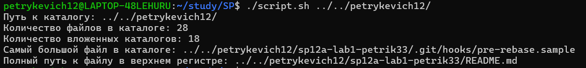

# Контрольная Работа №1

## General

БГУ, ФПМИ, 12 Группа, Петрикевич Тимофей



## How it Works

Скрипт использует команду `find` с необходимыми флагами, чтобы рекурсивно искать в указанной директории и получать информацию о её содержимом. Затем он обрабатывает вывод различными командами, такими как `wc`, `sort`, `head` и `awk`, для извлечения соответствующей статистики.

В частности, сортируя файлы по соответствующему признаку с помощью `sort`, можем использовать
`head -1`, чтобы выбрать первый элемент и `awk`, чтобы вывести только необходимую часть.

Скрипт выведет следующую информацию:

- Путь к директории.
- Количество файлов в директории.
- Количество вложенных директорий в директории.
- Полный путь к наибольшему файлу в директории.
- Полный путь к первому файлу в директории с буквой в верхнем регистре.

Если указанный аргумент не является действительным путём к директории, скрипт выведет сообщение об ошибке и завершится с кодом ошибки.

## Usage

Для запуска скрипта нужно указать полный путь к директории, которую вы хотите проанализировать, в качестве аргумента. Вот пример команды:

```bash
./script.sh /путь/к/директории
```

Предварительно может потребоваться изменение права файла на исполнение:

```bash
chmod +x script.sh
```
